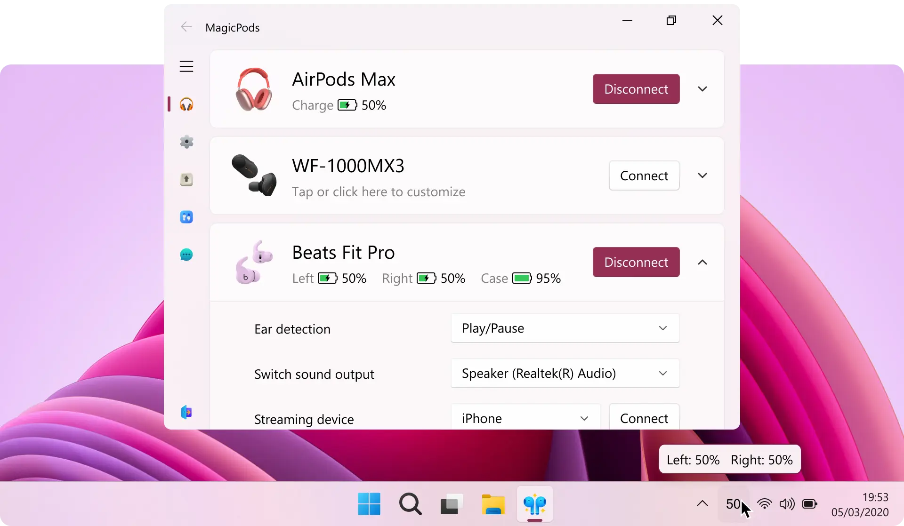

# <a href="https://apps.microsoft.com/store/detail/9P6SKKFKSHKM" target="_blank"></a> MagicPods [](https://weblate.magicpods.app/engage/magicpods-windows/)
The MagicPods introduce the IOS experience of AirPods to Windows. The full list of available features and supported headphone models can be found on [help.magicpods.app](https://help.magicpods.app/).

<a href='https://apps.microsoft.com/store/detail/9P6SKKFKSHKM'></a>

## Core Features

**Battery Indicator**

Displays the battery level of AirPods, Galaxy Buds, and most other Bluetooth headphones — in the app, system tray, Windows 11 widget, and Windows 10 live tile.

**Ear Detection**

Automatically pauses playback when you remove an earbud and resumes when you put it back in.

**iPhone-Style Popup Animation**

Shows an animated popup when opening the case — similar to iOS. Compatible with all AirPods models and select Beats headphones.

**VoiceOver**

Reads notifications aloud on Windows 10 and 11 — works offline without an internet connection.

**Audio Streaming**

Turn your PC into a wireless speaker: stream audio from your iPhone, Nintendo Switch, or any other Bluetooth device.

**Hotkeys**

Use customizable hotkeys to quickly manage headphone connections, noise control modes, audio output, Bluetooth, and VoiceOver on Windows 10 and 11.

**Low Battery Notification**

Receive alerts when your AirPods, Beats, or Galaxy Buds are running low on battery.

## Full AirPods Support with [MagicAAP Driver](https://magicpods.app/magicaap/)

**Noise Control**

Supports Off, Transparency, Adaptive, and Noise Cancellation modes (availability depends on the AirPods or Beats model).

**Conversation Awareness**

Automatically lowers media volume on Windows when a conversation is detected.

**Button Customization**

Customize actions for AirPods and supported Beats models: assign functions to touch controls and the Digital Crown on AirPods Max — just like on iPhone.

**Accessibility Features**

Includes iPhone-like accessibility settings such as adjustable press speed and duration, one-earbud noise cancellation, volume tuning, and more.

## Galaxy Buds Support

**Noise Control**

Supports Off, Transparency, Adaptive, and Noise Cancellation modes (availability depends on the Galaxy Buds model).

**Ear Detection**

Automatically pauses playback when you remove an earbud and resumes when you put it back in.

## Full Support for Fake Airoha AirPods

**Chip & Firmware Display**

Shows separate chip and firmware versions for the left and right earbuds.

**Noise Control**

Supports Off, Transparency, Adaptive, and Noise Cancellation modes (availability depends on the specific model).

**Ear Detection**

Automatically pauses playback when an earbud is removed and resumes when reinserted.

**Head Tracking**

Simulates spatial audio by tracking head movements.

**Left/Right Sensitivity Control**

Independently adjust touch sensitivity for each earbud stem.

**Press Speed**

Set the tap speed for double and triple-tap gestures.

**Long Press Duration**

Customize how long the stem must be held for a long-press action.

**Enhanced Multipoint Connection**

Toggle the ability to connect to two devices simultaneously.

**Wind Noise Reduction**

Reduce wind noise with adjustable sensitivity (Low, Medium, High).

**Equalizer**

Choose from EQ presets: Live Show, Cinema Stereo, Stage Rhythm, Classic.

**Game Mode**

Enable low-latency audio for smoother gameplay.

## Headphones Supported
| Apple            | Beats                  | Samsung           | Sony       | Fake Airoha AirPods         |
| ---------------- | ---------------------- | ----------------- | ---------- | --------------------------- |
| AirPods 1        | PowerBeats Pro         | Galaxy Buds       | WF-1000XM3 | AirPods Pro 2 Airoha 1571AM |
| AirPods 2        | PowerBeats Pro 2       | Galaxy Buds Plus  | WH-1000XM4 | AirPods Pro 2 Airoha 1562AE |
| AirPods 3        | PowerBeats 3           | Galaxy Buds Live  |            | AirPods Pro Airoha 1562AE   |
| AirPods 4        | PowerBeats 4           | Galaxy Buds Pro   |            | AirPods Pro Airoha 1562AE   |
| AirPods 4 (ANC)  | Beats Fit Pro          | Galaxy Buds 2     |            |                             |
| AirPods Pro      | Beats Studio Buds      | Galaxy Buds 2 Pro |            |                             |
| AirPods Pro 2    | Beats Studio Buds Plus | Galaxy Buds Fe    |            |                             |
| AirPods Max      | Beats Studio Pro       | Galaxy Buds 3     |            |                             |
| AirPods Max 2024 | Beats Solo 3           | Galaxy Buds 3 Pro |            |                             |
|                  | Beats Solo Pro         |                   |            |                             |
|                  | Beats Studio 3         |                   |            |                             |
|                  | Beats X                |                   |            |                             |
|                  | Beats Flex             |                   |            |                             |
|                  | Beats Solo Buds        |                   |            |                             |


## Usage
1. Pair your AirPods to your PC
2. Run the MagicPods
3. Choose the settings you like (optional)
4. Open the AirPods case
5. Watch the magic happen

*After AirPods is connected to your PC the MagicPods will search your AirPods 10 seconds to be to be sure that AirPods are yours.*

Now all functions are turn on and available for work. Enjoy.

## Translation
You can get MagicPods for free just help to translate the MagicPods. Follow this guide [Add your native language](https://github.com/steam3d/MagicPods-Windows/issues/23) to start. When you've finished translating, email MagicPods@outlook.com to get MagicPods activation code.

## Other headphones
If you have powerbeats3, beatsx or beatsSolo3 please follow this guide [Help with supports new headphones](https://github.com/steam3d/MagicPods-Windows/issues/21) to provide extra information about them. It will help to understand if it is possible to add support these headphones to MagicPods.

## Report bug
Ask a question at github page or write your problem to MagicPods@outlook.com

## Donation
<a href='https://boosty.to/steam3d'></a>

Ton
```
EQDU3Pagbzs0VTiF47QKnCGDZtWHsk0jOSPKYR6jSJtnkcpN
```


## Join to Discord server

<a href='https://discord.com/invite/UyY4PY768V'></a>
